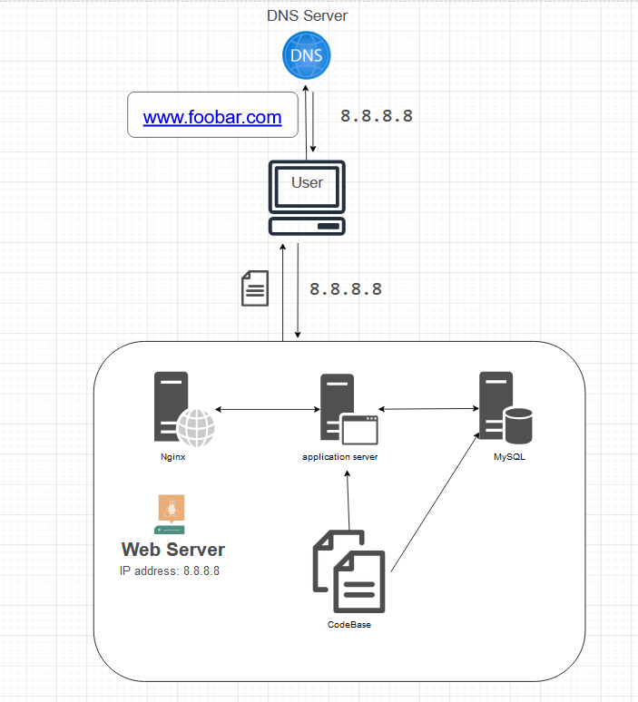

# A simple web stack

## Specifics About This Infrastructure
- **What is a server**
A server is a computer hardware or software that provides services to other computers, they are usually called clients.

- **What is the role of the domain name**
The domain name serves as a human-readable label that corresponds to a specific IP address on the internet, eg. 

- **What type of DNS record www is in www.foobar.com**

- **What is the role of the web server**

- **What is the role of the application server**

