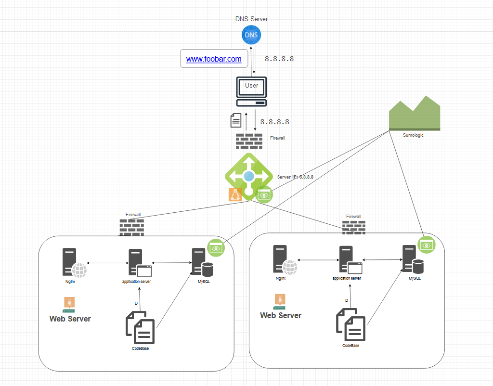

# Secured and monitored web infrastructure

## Desrciption:
A 3-server web infrastructure that is secured, monitored, and serves encrypted traffic.

## Specifics About This Infrastructure

- **What are firewalls for?**
 Firewalls are essential for enforcing security policies, restricting unauthorized access to the network, and mitigating various types of cyber threats such as malware, DDoS attacks, and unauthorized access attempts. They help safeguard sensitive data, maintain regulatory compliance, and ensure the integrity and availability of network resources.

- **Why is the traffic served over HTTPS?**
 Serving traffic over SSL Certificate for HTTPS encrypts the data exchanged between the web server and the client's browser, ensuring confidentiality and integrity of sensitive information such as login credentials, payment details, etc. This prevents eavesdropping, data manipulation, and other security risks associated with transmitting data over unencrypted HTTP connections.

- **What monitoring is used for?**
 The monitoring clients are for monitoring the servers and the external network. Monitoring is used to track the health, performance, and availability of infrastructure components and applications. It helps detect issues, identify bottlenecks, and optimize resource utilization. Monitoring facilitates proactive problem resolution, improves system reliability, and enhances overall user experience.

- **How the monitoring tool is collecting data**
 Monitoring tools collect data through various methods such as agent-based monitoring, SNMP polling, log scraping, and API integrations. Data collectors gather metrics, logs, and events from different sources, consolidate them into a centralized repository, and analyze the information to generate actionable insights and alerts.

- **Explain what to do if you want to monitor your web server QPS**
 To monitor the web server's QPS (Queries Per Second), you can deploy monitoring agents or utilize server-side instrumentation to collect metrics related to incoming requests, response times, and throughput. Monitoring tools can then analyze these metrics, set thresholds, and trigger alerts when QPS exceeds predefined limits, indicating potential performance issues or spikes in traffic.

## Issues With This Infrastructure

- **Why terminating SSL at the load balancer level is an issue?**
 Terminating SSL at the load balancer level can expose decrypted traffic within the internal network, increasing the risk of data exposure and interception. It bypasses end-to-end encryption, potentially compromising data confidentiality and integrity, especially if the internal network is not adequately secured.

- **Why having only one MySQL server capable of accepting writes is an issue?**
 Having only one MySQL server capable of accepting writes introduces a single point of failure and scalability bottleneck. If the MySQL server fails or becomes overloaded, it can disrupt database operations and impact application availability. Additionally, it limits scalability and performance as the workload grows.

- **Why having servers with all the same components (database, web server and application server) might be a problem**
 Deploying servers with identical components (e.g., database, web server, and application server) increases the risk of correlated failures and reduces fault isolation. If a common component experiences issues or requires maintenance, it affects all servers simultaneously, leading to widespread service disruptions. Introducing diversity in server configurations can enhance resilience and fault tolerance.
