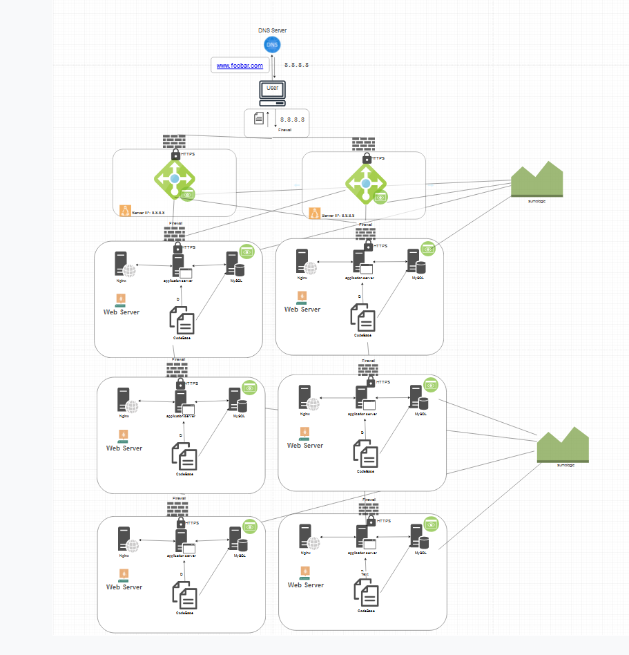

# Scaled Up Web Infrastructure

## Description:
This web infrastructure is a scaled up version of the infrastructure described [here](2-secured_and_monitored_web_infrastructure.md). In this version, all SPOFs have been removed and each of the major components (web server, application server, and database servers) have been moved to separate GNU/Linux servers. The SSL protection isn't terminated at the load-balancer and each server's network is protected with a firewall and they're also monitored.

## Specifics About This Infrastructure

- **1 Server**
 We deploy a single physical or virtual server to host our infrastructure components. This server provides the computing resources (CPU, memory, storage) required to run our web and application servers, as well as the database.

- **1 Load-Balancer (HAProxy):**
 We use HAProxy as a load balancer to distribute incoming traffic across multiple instances of our web and application servers. By configuring HAProxy in a cluster with redundancy, we ensure high availability and fault tolerance. It improves scalability and resilience by evenly distributing the workload and directing requests to healthy servers.

- **Split Components with Separate Servers:**
 By separating components into distinct servers, we achieve better resource utilization, scalability, and fault isolation. It allows us to scale each component independently based on workload demands, optimize resource allocation, and streamline maintenance and troubleshooting efforts.
